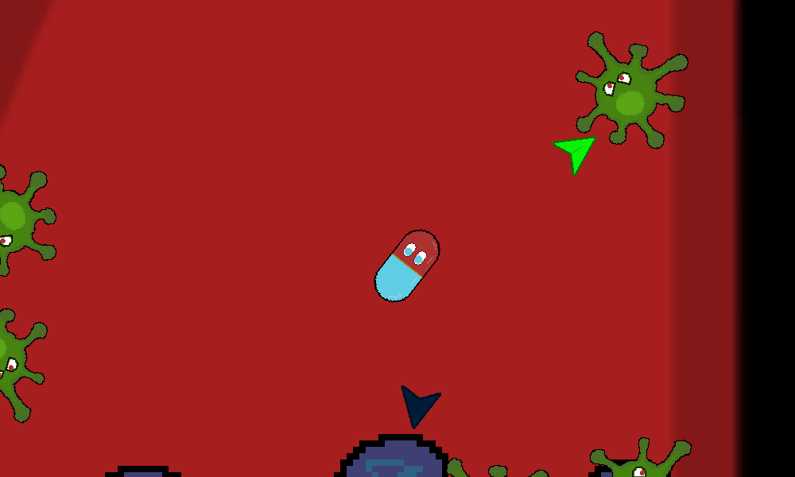
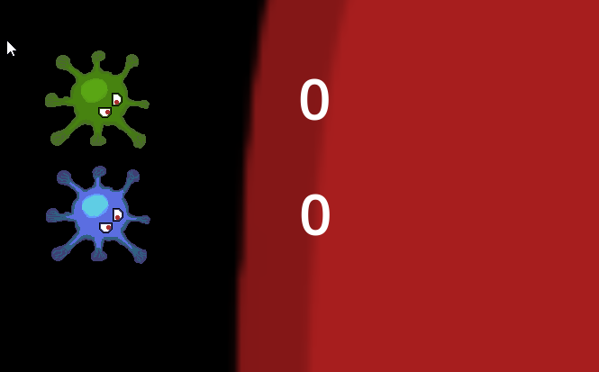

# Sick Day Delivery

Defeat the infection by delivering medicine to the affected areas.

## Story

It's a regular Thursday and a new strain of bacterial infection has just mutated into existence. Fortunately for the human race, the mutation has originated in the employee lounge of the pre-imminent pharmaceutical company, **Berk, Berk, & Burk**. The employee was not feeling well and went straight to the HR department who have access to the top of the line pain reliever pills.

**Berk, Berk, & Burk** staf biologists have dubbed the strain, **Icki Iky**. They are not entirely sure what all is does, but they can tell that it is nothing good. It must be stopped.

You control a dose of the state of the art nanobot pain reliever pill, **Lololol®**. You've been administered to Patient Zero to stop the spread of the pathogen in its tracks.

## How to Play

| Action | Control |
|--|--|
| 🔼 Move Forward | `W` |
| 🔽 Move Backward | `S` |
| ↪ Rotate Left | `A` |
| ↩ Rotate Right | `D` |
| 🛑 Brake | `Shift` |
| 💊 Medicine Burst | `Space` |

Once you enter the body, you'll begin detecting the **Icki Iky**. Your Colony and Bacterium indicators will appear to show you the direction to the nearest of each. The green arrow is for the nearest individual bacteria, the dark blue points to the nearest Colony.

Colonies will continue to spawn bacteria and increase the patient's septic level. You MUST remove all of the infection before the patient becomes septic. Check how close the patient is to becoming septic by viewing the bar to the right of the screen. Once it goes all the way to the top, there is no more hope for the patient.

### Attacking 🦠💊

There are 2 ways to attack. For the smaller bacteria you can use the Medicine Burst or simply ram them, as you are medication yourself.

#### Bump Attack

#### Medicine Burst

For the colonies, they can only be destroyed by the powerful medication burst at point blank so be sure to get in close.

To track how we'll you're doing you can also use the bacteria and colony counters in the top left corner.

